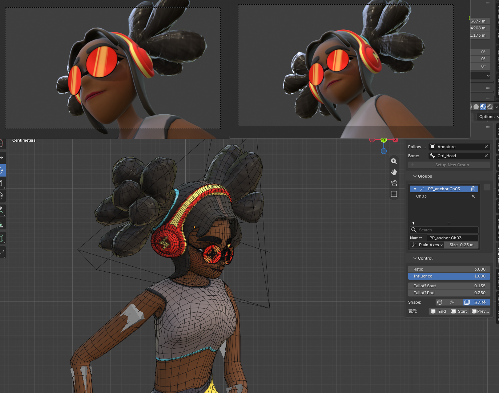
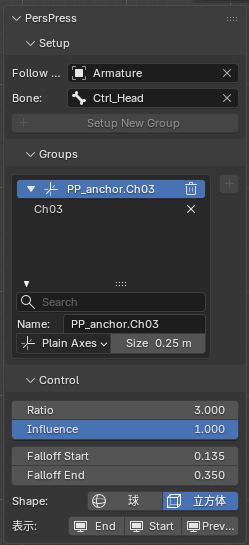

# PersPress

広角レンズで生じるキャラクター頭部のパース歪みを、カメラ視線方向の深度リマップ（逆パース）で補正する Blender アドオンです。頭部だけ望遠レンズで撮ったような見た目にしつつ、背景や身体は広角のパースを保てます。

## 動作環境

- Blender 5.2 LTS 以降

## インストール

1. `perspress-x.y.z.zip`（Extensions 形式）を用意します
2. Blender の `編集 > プリファレンス > エクステンション` 右上のメニューから「Install from Disk...」で zip を選択します

## 基本的な使い方

1. シーンにアクティブカメラを設定します
2. 3D ビューポートのサイドバー（N キー）→「PersPress」タブを開きます
3. 補正したいメッシュ（顔・髪など）を選択し、必要なら **Follow Target**（追従先。アーマチュアの場合はボーンも指定可）を設定して **Setup New Group** を押します
4. 生成されたアンカー Empty がグループのコントローラです:
   - **Ratio**: 圧縮率（仮想望遠焦点 / 実焦点に相当。大きいほど望遠寄りの見た目）
   - **Influence**: 効き（0–1。キーフレーム可）
   - **Falloff Start / End**: 補正 100% を維持する半径と、補正が 0 になる半径（首など、動かしたくない境界の内側で減衰を終わらせます）
   - アンカーを移動すると補正中心を微調整できます

### グループ管理（Groups リスト）

- リストの行クリックでアクティブグループを切替（ハイライト行が操作対象）
- ▼/▶ で各グループの折りたたみ、🗑 でグループ解除、× でメンバー個別解除、右の ＋ で選択メッシュを追加
- 検索欄下のフィルター領域でグループのリネーム・アンカー表示の変更ができます

### 減衰形状とギズモ

- **Shape**: 減衰領域を球 / 立方体で切替。領域の向きは常にカメラに整列します
- **表示トグル**: Start / End のワイヤーギズモと、補正による潰れを可視化する Preview を個別に表示できます（いずれもレンダリングには写りません）

## 特徴

- 補正はすべて Geometry Nodes とドライバーで完結するため、**レンダーファームにアドオン不要**（.blend 単体でヘッドレスレンダリング可能）
- アンカー平面上の点は画面位置が変わらない定式化のため、画面端の顔やカメラシフトでも位置ズレしません
- 補正後のメッシュには非補正時の位置・法線が `pp_rest_position` / `pp_rest_normal` 属性として保持され、マテリアルの AOV 出力（法線パス等）に利用できます

## 既知の制限

- フォールオフギズモの向きはセットアップ時のカメラに追従します。マーカー等でカメラを切り替えた場合、補正本体は追従しますがギズモ表示の向きは更新されません
- シーンの単位はメートル基準を想定しています（Falloff の初期値算出）

## ライセンス

GPL-3.0-or-later
